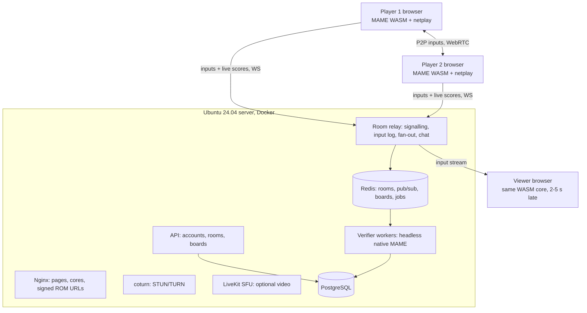

# 00 · Overview

## Goal
Play MAME games in the browser, online with 2-4 players, watched live by viewers, with a
shared, cheat-proof leaderboard. Server runs on Ubuntu 24.04.

## Chosen architecture: hybrid (option C)
- **Players**: MAME compiled to WebAssembly runs in each browser. Players exchange *inputs*
  (not video) peer-to-peer over WebRTC data channels; lockstep with 2-3 frames input delay,
  rollback later for selected games.
- **Viewers**: run the same WASM core and replay the input stream from the relay, 2-5 s behind
  live. Optional video fallback via LiveKit.
- **Server**: serves files, relays inputs, stores data, and re-checks every score by replaying
  the input log in headless native MAME built from the same commit.

Fallback (option A, server-side emulation + video) is used for games whose ROMs may not be
sent to browsers. Netplay, spectating and leaderboard designs still apply there.

## Diagram

## Out of scope for v1
User-uploaded ROMs, mobile touch controls, online play for drivers without `MACHINE_SUPPORTS_SAVE`.
